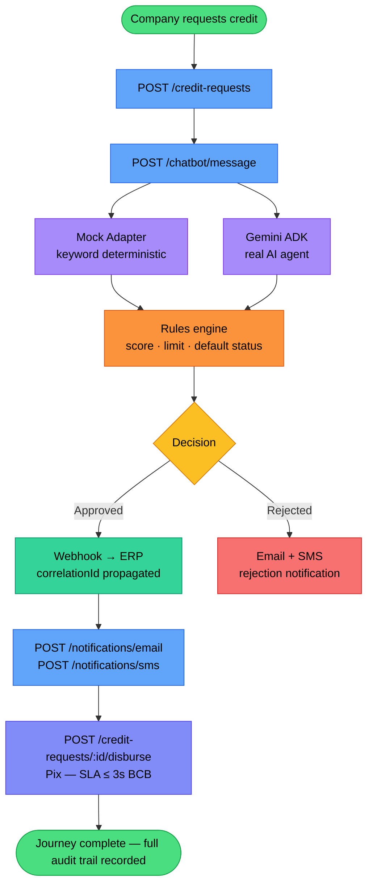
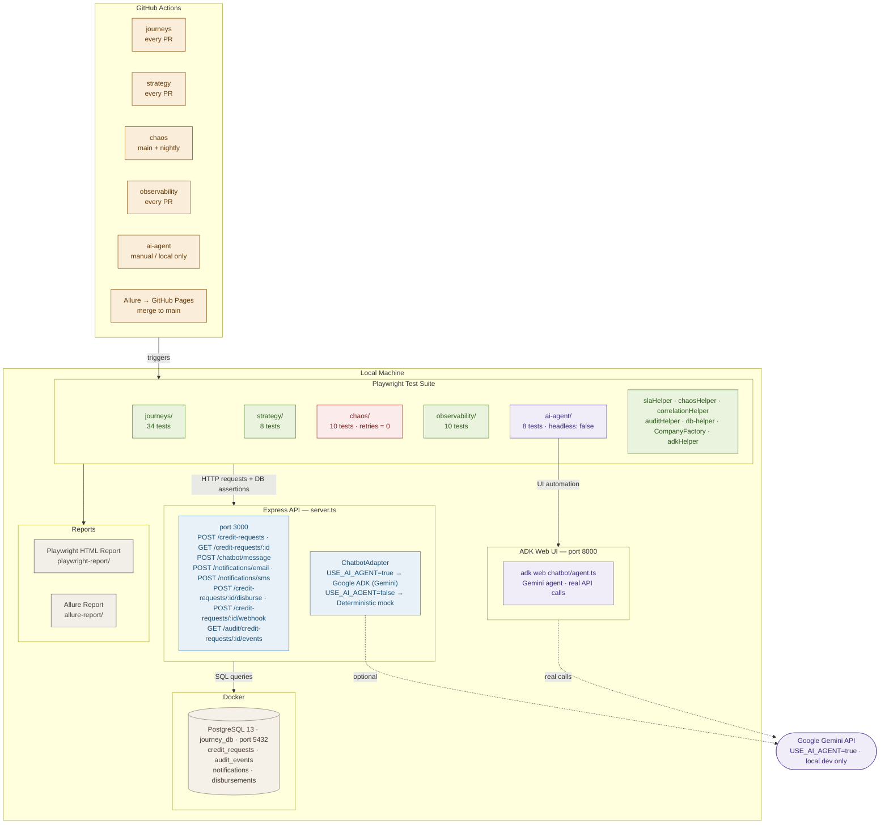

# digital-journey-tests


**Author:** Luiz Gustavo Miotto · [LinkedIn](https://www.linkedin.com/in/miottto)

> **API-level** automated test suite for digital communication journeys — chatbot qualification, credit decisioning, email and SMS notifications, and Pix disbursement.
> Tests interact directly with HTTP endpoints and assert against PostgreSQL. The `ai-agent` layer also drives the ADK Web UI to validate the real Gemini agent end-to-end.

---

## The journey

A company requests credit. An AI agent classifies the intent, the rules engine decides, and the outcome — approval or rejection — triggers notifications and, if approved, a Pix disbursement. A single `correlationId` threads through every step of the chain.



> *Each step in the journey is tested in isolation by design — enabling precise failure diagnosis, parallel execution, and independent SLA measurement. The `ai-agent` layer validates the Gemini agent separately via the ADK Web UI.*

---

## Test layers

| Layer | Tests | What it validates |
|---|---|---|
| journeys | 34 | Real user flows — creation, chatbot, notifications, disbursement, webhook to ERP |
| strategy | 8 | Business boundaries, idempotency, retry storms |
| chaos | 10 | Graceful degradation — 503, malformed payloads, concurrent requests |
| observability | 10 | Per-step SLA, correlationId across all layers, audit trail |
| ai-agent | 8 | Real Gemini agent via ADK Web UI — intent classification, data extraction, session context |
| **Total** | **70** | |

---

## Why this suite is built this way

**On test strategy** — business rules are validated at exact boundaries. `score=300` approves, `score=299` rejects. `requestedAmount=5000` is accepted, `4999` is not. A test that misses by one unit misses the bug entirely.

**On chaos engineering** — each chaos scenario maps to a real production incident: email service returning 503, a null body leaking a stack trace, concurrent disbursements creating duplicate records. Chaos tests have zero retries by design. A test that passes on retry is not a green test — it is a masked failure.

**On observability** — a `correlationId` is generated at the start of every journey and must appear in the API response, the database record, every audit event, and every notification. SLA assertions go further: the Pix disbursement must complete in under 3 seconds, not because we chose that number, but because the Brazilian Central Bank mandates it.

**On the AI adapter** — the `ChatbotAdapter` switches between the real Gemini agent and a deterministic mock via a single environment variable. CI always runs with the mock — fast, free, non-flaky. The `ai-agent` Playwright project is the only layer that targets the real Gemini endpoint, driving the ADK Web UI directly at `localhost:8000`.

**On infrastructure choices** — notifications are validated directly in PostgreSQL rather than through Mailosaur or Twilio. This eliminates external dependencies, keeps CI free and fast, and produces more precise assertions — the exact recipient, subject and correlationId stored in the database, not just whether an inbox received something.

---

## Infrastructure



---

## How to run

```bash
# Setup
git clone https://github.com/miottto/digital-journey-tests
cd digital-journey-tests
npm install && npx playwright install chromium
cp .env.example .env
docker-compose up -d

# Run all tests (including AI agent — requires GEMINI_API_KEY)
npm run test:all

# Run all tests except AI agent
npx playwright test

# Run by layer
npm run test:journeys
npm run test:strategy
npm run test:chaos
npm run test:observability

# Run AI agent tests (requires GEMINI_API_KEY, starts ADK Web UI automatically)
npm run test:ai-agent

# Start ADK Web UI manually (port 8000, kills previous instance first)
npm run adk-web

# Reports
npx playwright show-report
npm run report:allure
```

---

## Stack

| Tool | Purpose |
|---|---|
| Playwright | API automation — HTTP requests and assertions |
| TypeScript | Strict typing across the suite |
| PostgreSQL (Docker) | Real DB assertions on every write |
| Google ADK | Gemini-powered chatbot agent |
| Allure Report | Timeline, traceability, flakiness detection |
| GitHub Actions | Per-layer CI with nightly chaos runs |
| Claude Code | AI pair programmer used throughout development |

---

## Documentation

- [`docs/test-plan.md`](docs/test-plan.md) — Test plan for the credit journey
